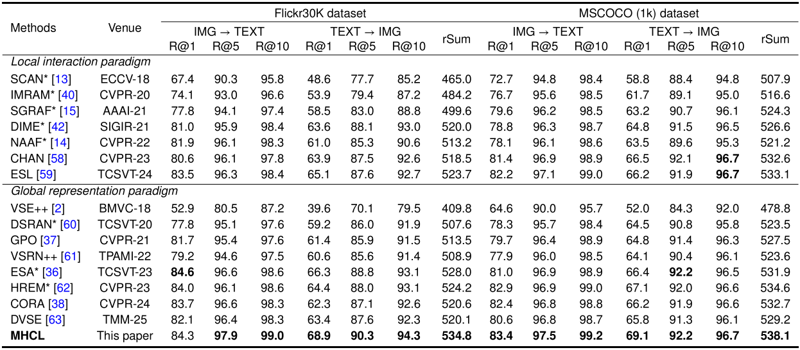

# Multi-Scale Hierarchical Contrastive Learning with Cross-Batch for Image-Text Retrieval

The implementation of our paper:  
**"Multi-Scale Hierarchical Contrastive Learning with Cross-Batch for Image-Text Retrieval"** (Conference/Journal, Year).

We referred to the implementations of [GPO](https://github.com/woodfrog/vse_infty), [VSE++](https://github.com/fartashf/vsepp), and [HREM](https://github.com/CrossmodalGroup/HREM) in building our codes.  


## Introduction

As a fundamental task in multimodal artificial intelligence, image-text retrieval faces the core challenge of constructing a unified and highly discriminative semantic representation space to enable precise cross-modal alignment. Existing mainstream local interaction paradigms, while effective in modeling fine-grained alignments, typically suffer from high computational costs, low inference efficiency, and an over-reliance on local matching, often neglecting global semantic consistency. In contrast, global representation paradigms are constrained by the expressive power of visual backbones and the limited number of negative samples within a single mini-batch, which can lead to multi-scale semantic confusion or omission. Consequently, such approaches struggle to simultaneously capture fine-grained local categories and learn accurate global semantics in complex scenarios. To address these limitations, we propose a Multi-scale Hierarchical Contrastive Learning (MHCL) framework, an efficient global representation approach that significantly enhances cross-modal semantic modeling capability and robustness while maintaining inference efficiency. Specifically, MHCL introduces a Hierarchical Global Aggregator (HGA), a Transformer-based module that employs hierarchical windowed attention to capture multi-scale visual semantics and long-range dependencies, thereby strengthening the discriminability and consistency of image and text representations. Furthermore, MHCL constructs a cross-batch Visual-textual Negative Sample Pool (V-T NSP), which extends the coverage of negative samples to thousands across batches without increasing peak GPU memory usage, substantially reinforcing the boundaries of contrastive learning. Finally, we propose a Hybrid Hubness-aware Contrastive Learning (HyHCL) strategy, which explicitly mitigates the dominance of “hub” samples in gradient updates and neighborhood structures, thereby improving the balance of retrieval results. 


## Preparation

### Environments

We recommended the following key dependencies.

- Python 3.9
- [PyTorch](http://pytorch.org/) 1.11
- transformers  4.36.0
- numpy 1.23.5
- nltk 3.7
- tensorboard-logger
- The specific required environment can be found [here](requirements.txt)


### Data
All data sets used in the experiment and the necessary external components are organized in the following manner:

You need get the pretrained checkpoint files for [BERT-base](https://huggingface.co/bert-base-uncased) model. You also can use the pretrained checkpoint downloaded by [swin-base](https://huggingface.co/microsoft/swin-base-patch4-window7-224).

```
data
├── coco
│   ├── precomp  
│   │      ├── train_ids.txt
│   │      ├── train_caps.txt
│   │      ├── ......
│   │── id_mapping.json
│   │── captions_val2014.json
│   ├── images   # raw coco images
│        ├── train2014
│        └── val2014
│  
├── f30k
│   ├── precomp  
│   │      ├── train_ids.txt
│   │      ├── train_caps.txt
│   │      ├── ......
│   │── id_mapping.json
│   ├── flickr30k-images   # raw flickr30k images
│          ├── xxx.jpg
│          └── ...
│   
└── vocab  # vocab files provided by SCAN (only used when the text backbone is BiGRU)

MHCL
├── bert-base-uncased    # the pre-trained checkpoint files for BERT-base
│   ├── config.json
│   ├── tokenizer_config.txt
│   ├── vocab.txt
│   ├── pytorch_model.bin
│   ├── ......

└── swin-base-patch4-window7-224   # the pretrained checkpoint files for swin-base
│   ├── config.json
│   ├── preprocessor_config.json
│   ├── model.safetentors
│   ├── tf_model.h5
│   ├── pytorch_model.bin
│   ├── ......
│  
└── ....


```

## Training

Train MSCOCO and Flickr30K from scratch:

```
#f30k
python train.py --dataset f30k --gpu-id 0 --logger_name runs/f30k --num_epochs 30 --batch_size 64 --learning_rate 5e-4 --vit_type swin --embed_size 1024 --warmup 8000 \
    --decay_rate 0.3 --workers 4 \
    --use_moco 1 \
    --moco_M 2048 \
    --loss_lamda 20 \
    --mu 90 \
    --gama 0.5 \
    --moco_r 0.999 \
```

```
#coco
python train.py --dataset coco --gpu-id 0 --logger_name runs/coco --num_epochs 30 --batch_size 64 --learning_rate 2e-4 --vit_type swin --embed_size 512 --lr_schedules [9, 15, 20, 25 ] --decay_rate 0.3 --workers 4
```


## Evaluation
Run ```eval.py``` to evaluate the trained models on f30k or coco,
or modify the corresponding parameters in eval.py to test the Flickr30K or MSCOCO data set:
```
python eval.py  --data_path "path/to/dataset" --dataset f30k 
python eval.py  --data_path "path/to/dataset" --dataset coco 
```

## Performances
The following tables show the results of image-to-text retrieval on **MSCOCO** and **Flickr30K** datasets. In these experiments, we use the pre-trained **Swin-base** as the visual encoder, and use the **BERT-base** as the textual encoder.




We also provide the training logs and checkpoint files for two datasets:

| Datasets  | I2T R@1 | I2T R@5 | I2T R@10 | T2I R@1 | T2I R@5 | T2I R@10 |                                                  Model checkpoint                            |
| :-------: |:-------:|:-------:|:--------:|:-------:|:-------:|----------|:--------------------------------------------------------------------------------------------:|
| Flickr30K |  84.3   |  97.9   |   99.0   |  68.9   |  90.3   | 94.3     | [Here](https://drive.google.com/drive/folders/1TXd9kBTvKKsx3fBFXuTCpAshcnZ2PKKn?usp=sharing) |
| MSCOCO-1K |  83.4   |  97.5   |   99.2   |  69.1   |  92.2   | 96.7     | [Here](https://drive.google.com/drive/folders/1Dy6eIWEl6sn7CmrcwZn2lArTGkvCjT43?usp=sharing) |
| MSCOCO-5K |  65.3   |  88.5   |   94.1   |  48.4   |  76.7   | 85.3     |                                           as above                                           |


## Citation

```

```
